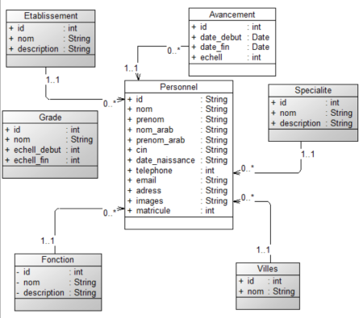
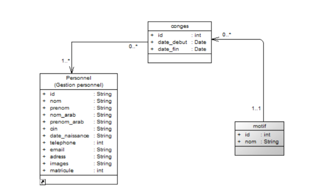
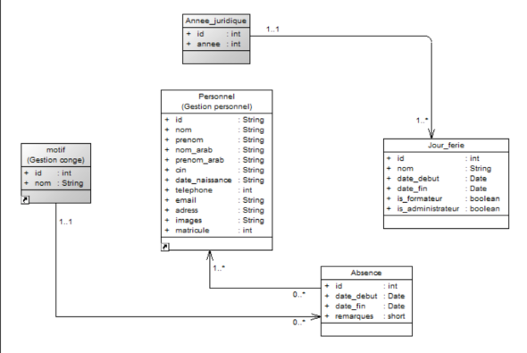

# Conception
{:class="sectionHeader"}
<!-- new slide -->

## Diagramme de classes
{:class="sectionHeader"}

<!-- new slide -->

### Prise de service

{:width="700px"}
*figure: diagramme de class gestion prise de service*

<!-- new slide -->

### Ordre de Missions

{:width="700px"}
*figure: diagramme de class gestion ordre des missions*

<!-- new slide -->

### Conges

{:width="700px"}
*figure: diagramme de class gestion conges*

<!-- new slide -->

### Absences

{:width="700px"}
*figure: diagramme de class gestion Absences*

<!-- new slide -->