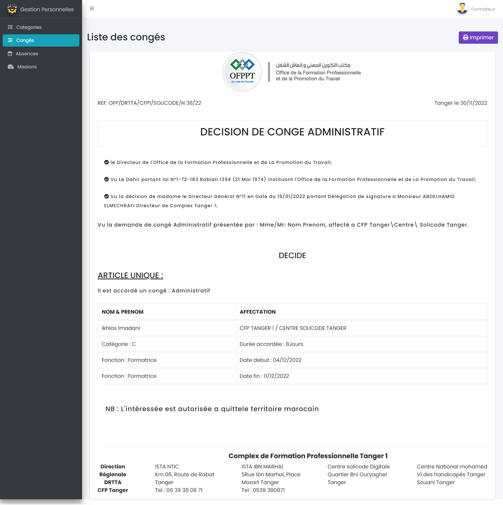
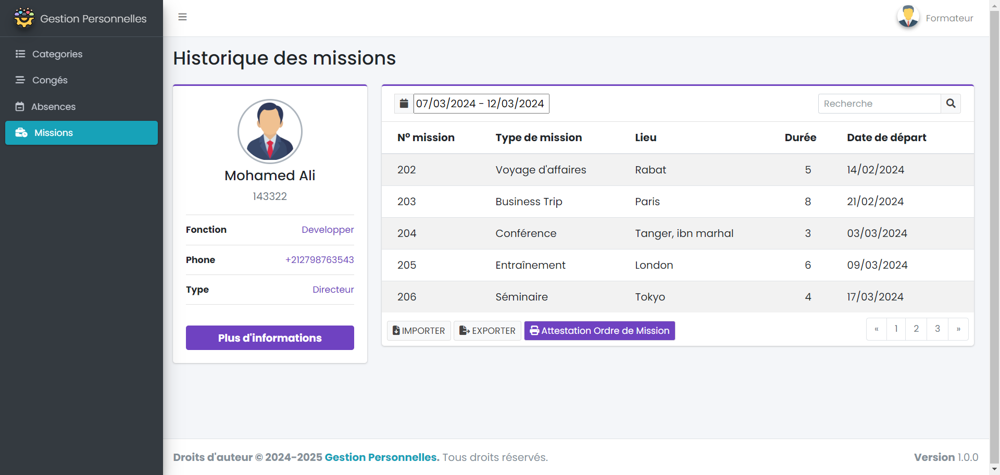

## Maquettes
{:class="sectionHeader"}

<!-- new slide -->

### Authentification
{:width="1000px"}*figure: Authentification* 

<!-- new slide -->

### Historique des categories
{:width="1000px"}*figure: Historique des categories* 

<!-- new slide -->

### Historique des congés
{:width="1000px"}*figure: Historique des congés* 

<!-- new slide -->

### Liste des congés
{:width="700px"}*figure: Liste des congés* 

<!-- new slide -->

### Historique des absences
{:width="1000px"}*figure: Historique des congés* 

<!-- new slide -->

### Document d'absentéisme
{:width="1000px"}*figure: Document d'absentéisme* 

<!-- new slide -->

### Imprimer document d'absentéisme
{:width="1000px"}*figure: Imprimer document d'absentéisme* 

<!-- new slide -->

### Historique des missions
{:width="1000px"}*figure: Historique des missions* 

<!-- new slide -->

### Attestation Ordre de Mission
{:width="700px"}*figure: Attestation Ordre de Mission* 
