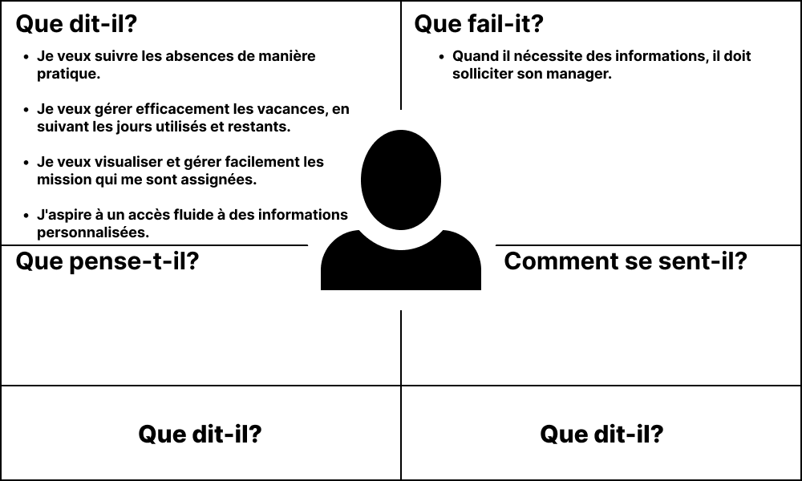

# Formateur

## Cart empathie formateur

{:width="700"}*figure: Empathie avec formateur* 

<!-- note -->

### Persona

- ESSARRAJ FOUAD

### Que dit-il?

- Je veux suivre les absences de manière pratique.
- Je veux gérer efficacement les vacances, en suivant les jours utilisés et restants.
- Je veux visualiser et gérer facilement les mission qui me sont assignées.
- J'aspire à un accès fluide à des informations personnalisées.
- Accès aux Documents : Obtenir des documents essentiels tels que :
    - Attestation de Travail
    - Décision de Congé Administratif
    - Attestation d'Ordre de Mission
    - Maquette dabsenteisme

### Que fail-it?

- Lorsqu'il a besoin d'informations ou de témoignages, il doit en faire la demande à son manager.

<!-- new slide -->