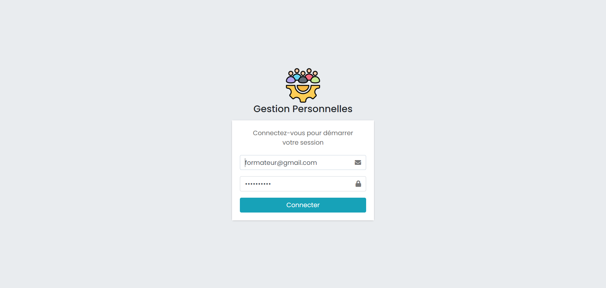
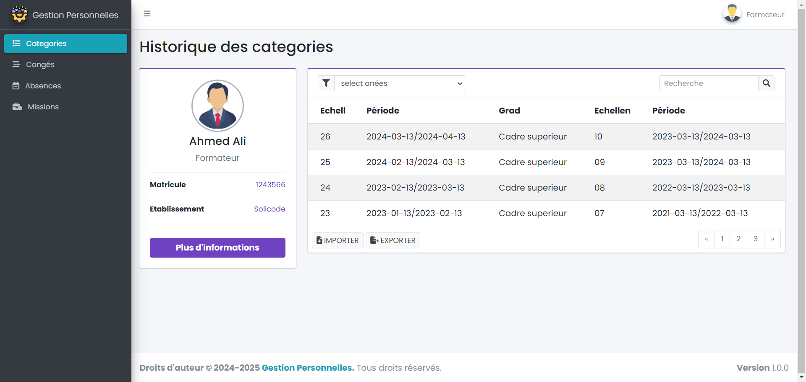
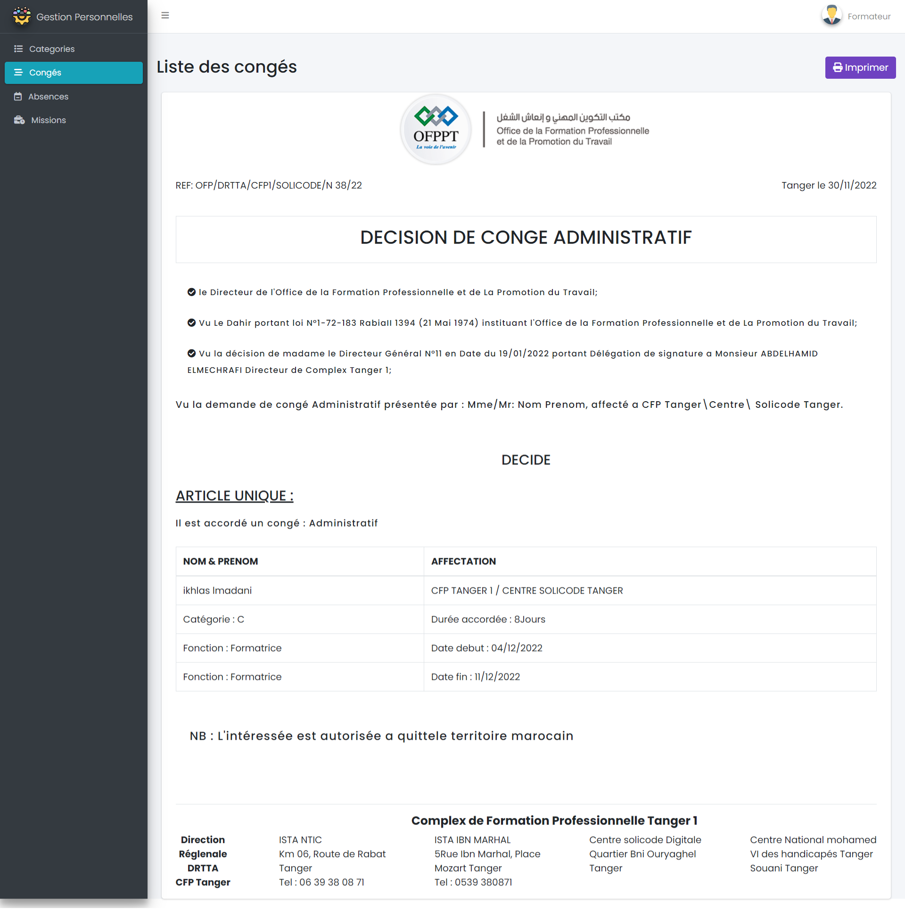
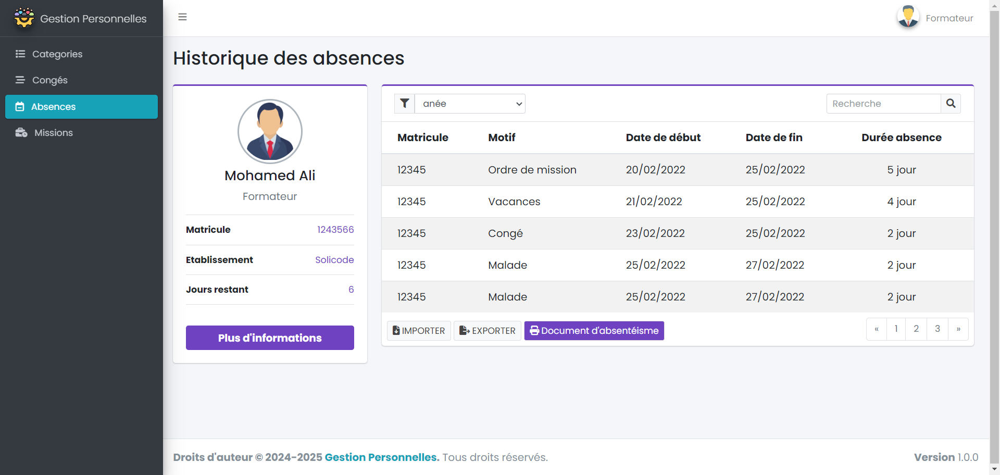
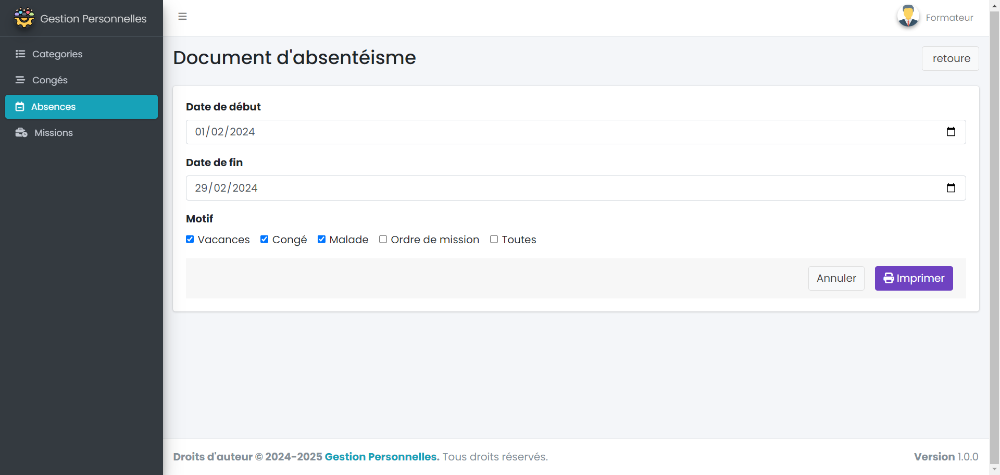
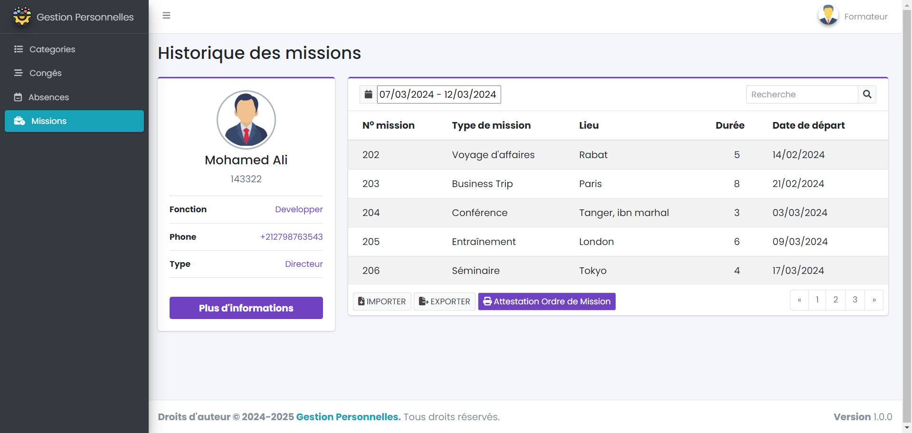
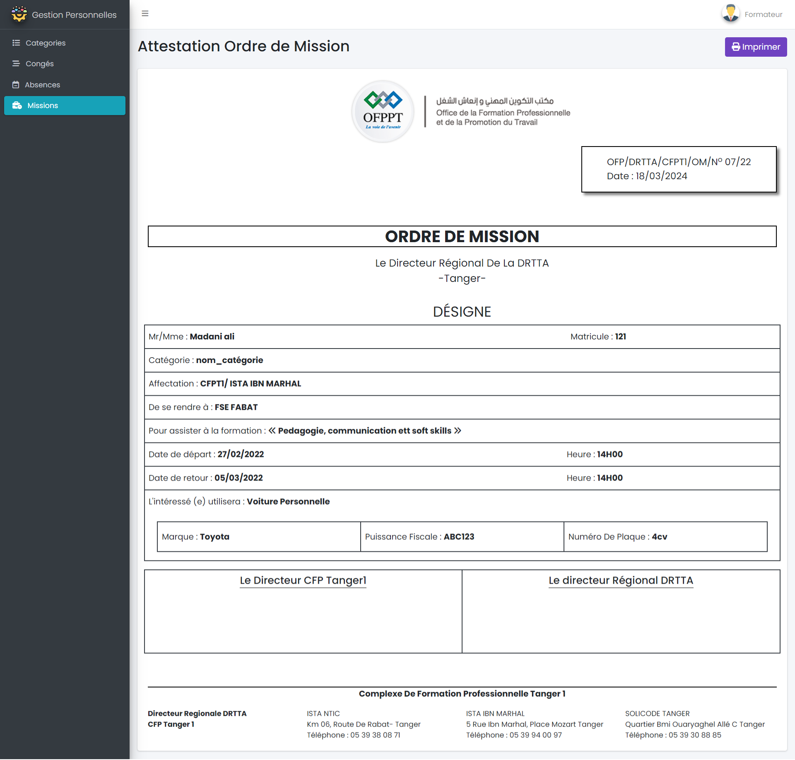

## Maquettes

**Authentification**
{:width="700"}*figure: Authentification* 

<!-- new slide -->

**Historique des categories**
{:width="700"}*figure: Historique des categories* 

<!-- new slide -->

**Historique des congés**
{:width="700"}*figure: Historique des congés* 

<!-- new slide -->

**Liste des congés**
{:width="700"}*figure: Liste des congés* 

<!-- new slide -->

**Historique des absences**
{:width="700"}*figure: Historique des congés* 

<!-- new slide -->

**Document d'absentéisme**
{:width="700"}*figure: Document d'absentéisme* 

<!-- new slide -->

**Imprimer document d'absentéisme**
{:width="700"}*figure: Imprimer document d'absentéisme* 

<!-- new slide -->

**Historique des missions**
{:width="700"}*figure: Historique des missions* 

<!-- new slide -->

**Attestation Ordre de Mission**
{:width="700"}*figure: Attestation Ordre de Mission* 

<!-- new slide -->