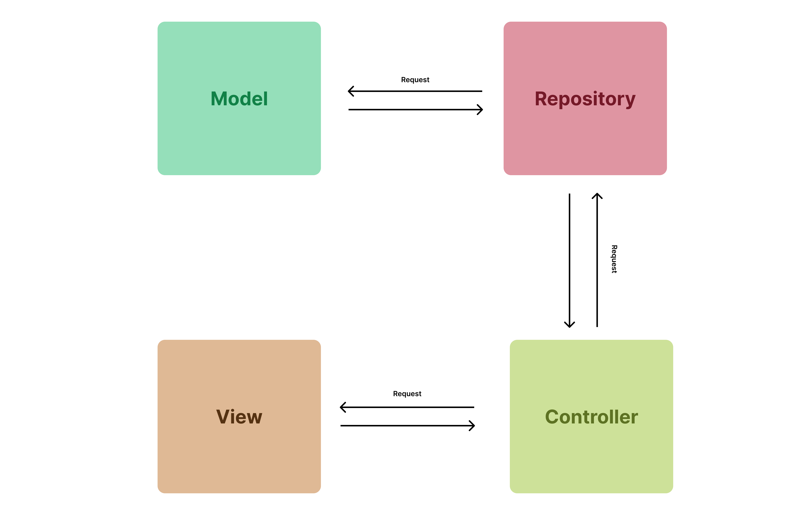

# Branche Techniques
{:class="sectionHeader"}

<!-- new slide -->

## Capturer des besoins techniques

Capturer des besoins techniques pour le projet de gestion de gestion personnels basé sur les fonctionnalités définies pour le Sprint 1 et en tenant compte du framework Laravel, de la base de données MySQL et du pattern Repository, voici une capture des besoins techniques :

### Technologies:

* **Backend: Laravel** (framework PHP)
* **Base de données**: MySQL
* **Gestion des dépendances**: Composer

### Architecture de l'application:

* **Modèle MVC (Model-View-Controller)**: Séparation des concerns en couches distinctes pour la logique métier (modèle), l'affichage (vue) et la gestion des requêtes (contrôleur).
* **Pattern Repository**: Utilisation de repositories pour encapsuler l'accès aux données et simplifier les interactions avec la base de données MySQL.

## Laravel

{:width="400px"}*Figure: Laravel*

## Mysql

{:width="400px"}*Figure: Mysql*

## Design pattern :  Repository

{:width="400px"}*Figure: Desing pattern*

<!-- note -->

Le pattern Repository est une technique de conception logicielle qui permet d'abstraire l'accès aux données et de simplifier les interactions avec la base de données MySQL dans une application Laravel. 

Avantages du Pattern Repository:

* **Abstraction de la couche persistance**: Le code métier ne dépend pas des détails d'implémentation de la base de données.
* **Réutilisabilité du code:** Les méthodes communes d'accès aux données peuvent être regroupées dans le repository.
* **Testabilité améliorée**: Les repositories peuvent être facilement testés unitairement.
* **Séparation des concerns**: Sépare la logique métier de l'accès aux données.

<!-- new slide -->

## MVC

{:width="400px"}*Figure: MVC*

<!-- note -->

Le Modèle-Vue-Contrôleur (MVC) est un schéma architectural qui sépare une application en trois composants principaux : le modèle, la vue et le contrôleur. Chaque composant répond à des aspects spécifiques du développement. Très utilisé en développement web, le MVC permet de concevoir des projets évolutifs.

**Modèle** :
Gère la logique des données, telles que leur manipulation ou leur affichage. Par exemple, un objet Client peut récupérer des informations de la base de données et les mettre à jour.

**Vue** :
Gère l'interface utilisateur, y compris les champs de texte, menus déroulants, etc., pour une interaction facile.

**Contrôleur** :
Fait le lien entre Modèle et Vue pour traiter la logique métier, les requêtes et la manipulation des données. Par exemple, le contrôleur Client gère les interactions et la mise à jour de la base de données, à travers le modèle Client.

<!-- new slide -->

## Prototype 

<!-- new slide -->

Nous avons développé un système CRUD pour les entités Projets et Tâches en utilisant le framework Laravel, avec des fonctionnalités d'autorisation et authentification et multilingue pour l'interface utilisateur afin de faciliter l'apprentissage des compétences nécessaires à la manipulation efficace de ce framework.