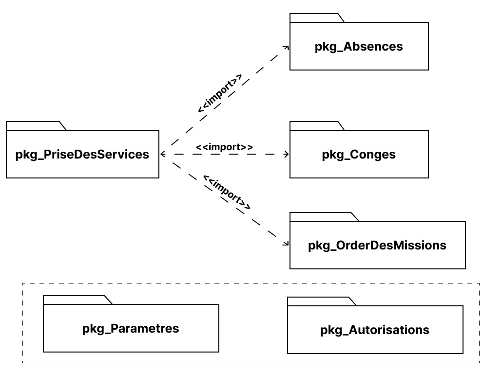

# Conception
{:class="sectionHeader"}

<!-- note -->

Dans le processus de conception d’une interface utilisateur, il est important de créer des maquettes pour les versions web et mobile pour s’assurer que l’interface répondra aux besoins des utilisateurs sur tous les types d’appareils. Les diagrammes UML de classes sont souvent utilisés pour créer ces maquettes, ce qui permet aux designers et aux développeurs de travailler ensemble pour créer des interfaces conviviales et fonctionnelles.

<!-- new slide -->

## Diagramme de packages

{:width="900px"}
*Figure: Diagramme de packages* 

<!-- new slide -->
