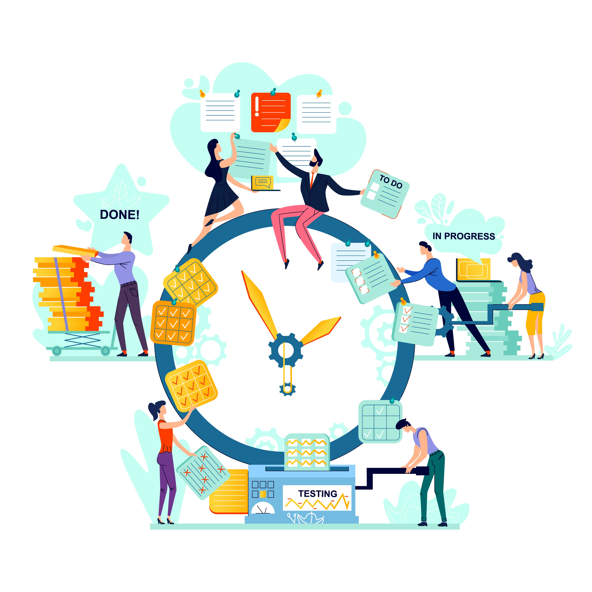

# Développement agile  
{:class="sectionHeader"}

<!-- note -->

Le développement Agile est une approche flexible et itérative qui vise à fournir des versions fonctionnelles du logiciel de manière régulière, en répondant aux besoins changeants des utilisateurs.
Dans ce chapitre, nous allons d'abord expliquer les principes fondamentaux de l'Agilité, ses avantages et ses limites. Ensuite, nous allons nous concentrer sur Scrum, l'une des méthodes Agile les plus populaires, en expliquant ses rôles clés, ses événements, ses artefacts et les bonnes pratiques pour réussir un projet Scrum.

<!-- new slide -->

## Méthode agile

{:width="700px"}*figure: Méthode agile*

En ingénierie logicielle, les pratiques agiles mettent en avant la collaboration entre des équipes auto-organisées et pluridisciplinaires et leurs clients. Elles s'appuient sur l'utilisation d'un cadre méthodologique léger mais suffisant centré sur l'humain et la communication.

<!-- new slide -->