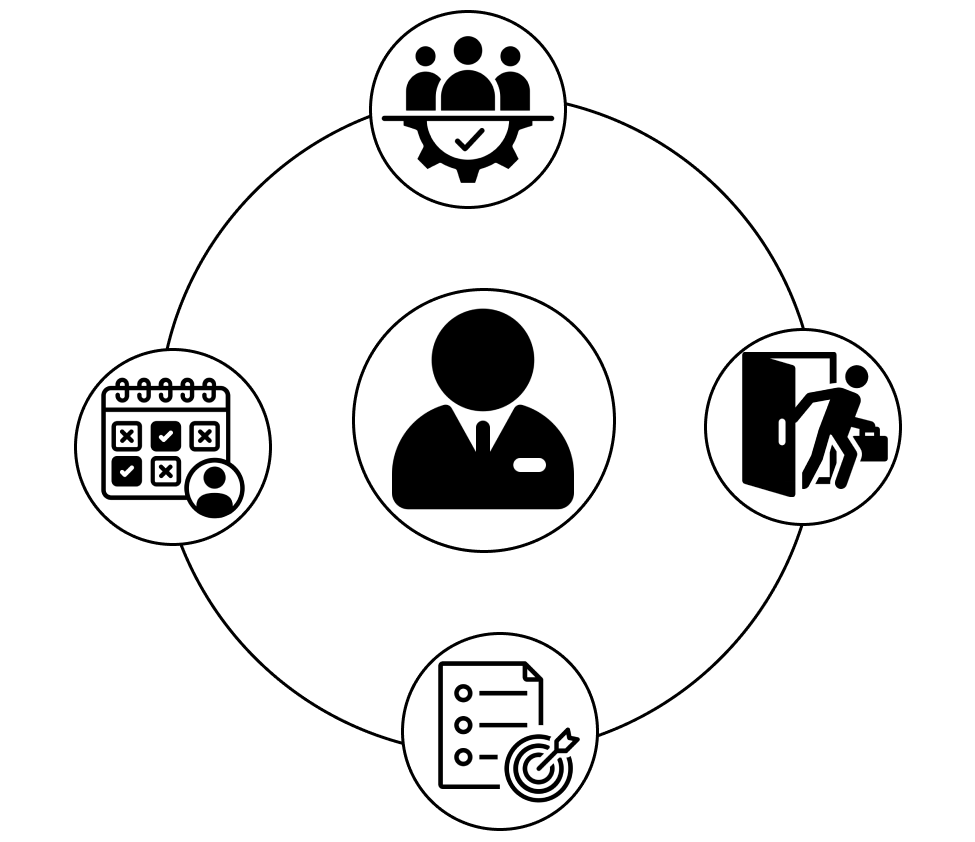

# Introduction

{:width="700px"}*figure 1: Introduction*

<!-- note -->

Le projet `Gestion Personnels` a été initié sous la direction de `M. Mechrafi`, Directeur Général de l'école. Ce projet, divisé en quatre parties, consiste en la création d'un site web regroupant chacune de ces composantes. Son objectif principal est d'améliorer la gestion des quatre aspects clés de la gestion des ressources humaines et de fournir des statistiques pertinentes pour éclairer les décisions stratégiques de l'organisation.

<!-- - La première partie, intitulée `Personnels`, vise à gérer l'ensemble du personnel travaillant sous la supervision du responsable. Elle permet l'ajout, la suppression et la modification des informations des employés, offrant ainsi une vision claire de la structure hiérarchique et des rôles de chacun.

- La deuxième partie, `Absences`, permet la gestion des absences des employés pour raisons de santé ou personnelles. Elle offre un suivi précis des heures d'absence et des raisons associées, facilitant ainsi la gestion des ressources et le maintien de la continuité opérationnelle.

- La troisième partie, `Congés`, centralise la gestion des congés et des jours de vacances des employés. Elle assure un suivi des jours de congé restants, des demandes en attente et des périodes de congé déjà accordées, favorisant ainsi une gestion équitable et transparente du temps de repos.

- La quatrième partie, `Ordre des Missions`, est dédiée à la gestion des tâches assignées à chaque employé. Son objectif est de fournir une vue d'ensemble des tâches à venir, de celles en attente d'exécution, ainsi que des détails associés à chaque mission. Cela garantit une répartition équilibrée des responsabilités et assure que les employés disposent des informations nécessaires pour mener à bien leurs missions.

En somme, le projet `Gestion Personnels` vise à optimiser la gestion du personnel de manière efficace et transparente, en fournissant des outils adaptés aux besoins spécifiques de l'organisation. -->

<!-- new slide -->
