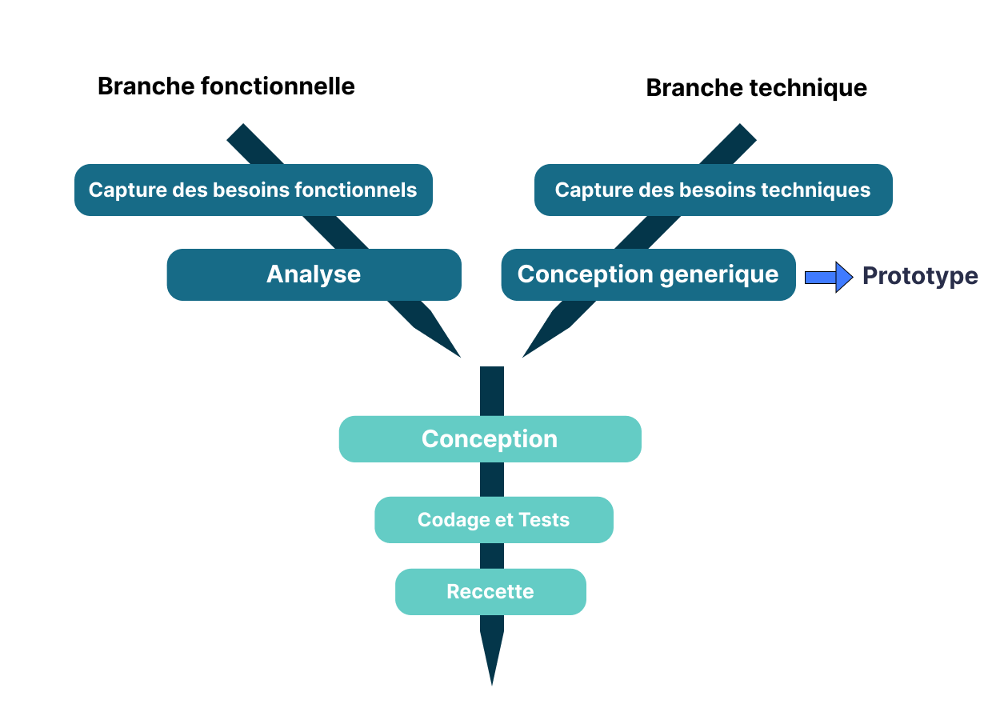
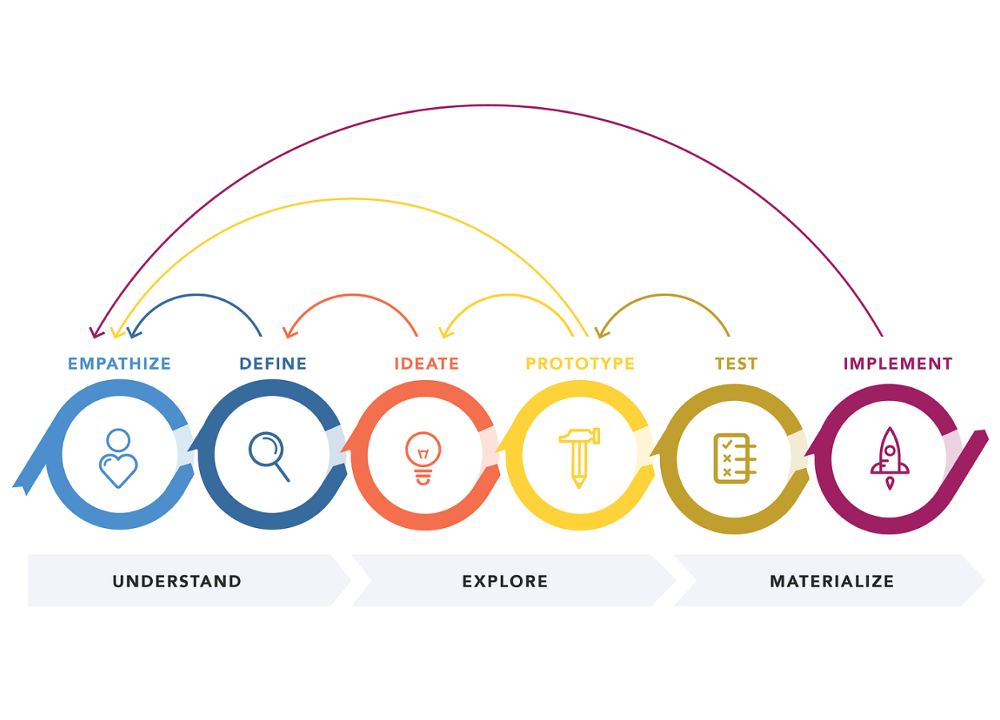

# Processus de développement
{:class="sectionHeader"}

<!-- note -->

Le processus de développement décrit une approche du développement logiciel. Il définit une séquence d'étapes, en partie ordonnées, qui concourent à l'obtention d'un système logiciel ou à l'évolution d'un système existant.
Donc ce chapitre sera divisé en deux parties ,la première partie portera sur 2TUP ,le deuxième partie design thinking.

<!-- new slide -->

## 2TUP

{:width="1000px"}_figure: 2TUP_

<!-- note -->

2TUP est un processus de développement logiciel qui implémente le Processus Unifié.
Il commence par une étude préliminaire qui consiste essentiellement :
- identifier les acteurs qui vont interagir avec le système à construire
- cahier des charges
- modéliser le contexte

Le processus s'articule ensuite autour de 3 phases essentielles: 
   - une branche technique 
   - une branchefonctionnelle
   - une phase de réalisation

**Branche fonctionnelle** qui consiste en la modélisation et le maquettage pour clarifier les besoinsfonctionnels.

**Branche Technique** qui recense toutes les contraintes à respecter pour réaliser le système Elledéfinit ensuite les composants nécessaires à la construction de l’architecture technique.

**La phase de réalisation** consiste à réunir les deux branches, permettant de mener une conceptionapplicative et enfin la livraison d'une solution adaptée aux besoins. Arrive par la suite l’étape decodage et enfin l’étape de recette, qui consiste à valider les fonctions du système développé.

<!-- new slide -->

## Design thinking

{:width="1000px"}_figure: Design thinking_

<!-- note -->

Le design thinking est une approche de l'innovation centrée sur l'humain. C'est une méthode ou un processus de conception globale, centré sur l'utilisateur (ou l'humain), en vue de réaliser des services ou produits innovants.

<!-- new slide -->

