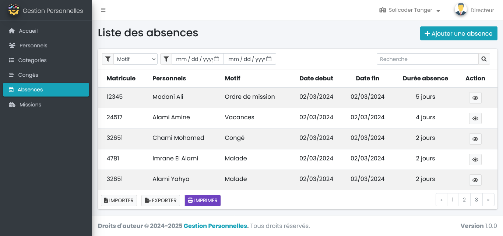
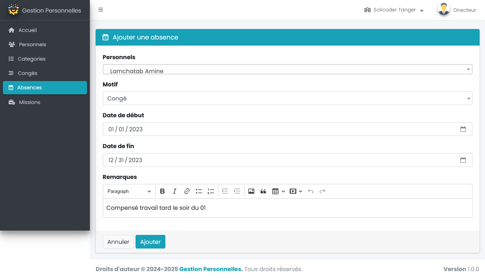
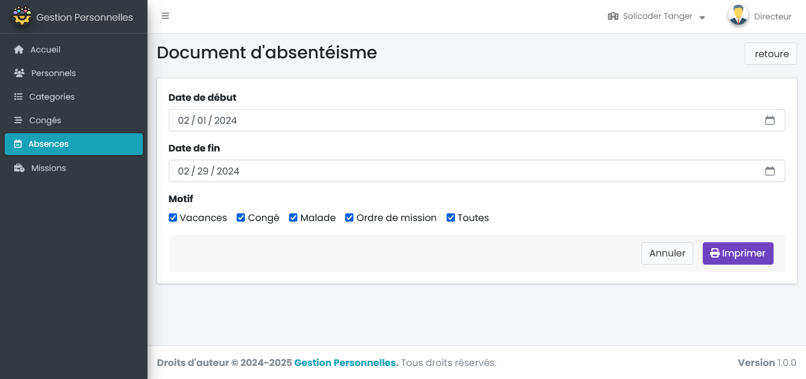
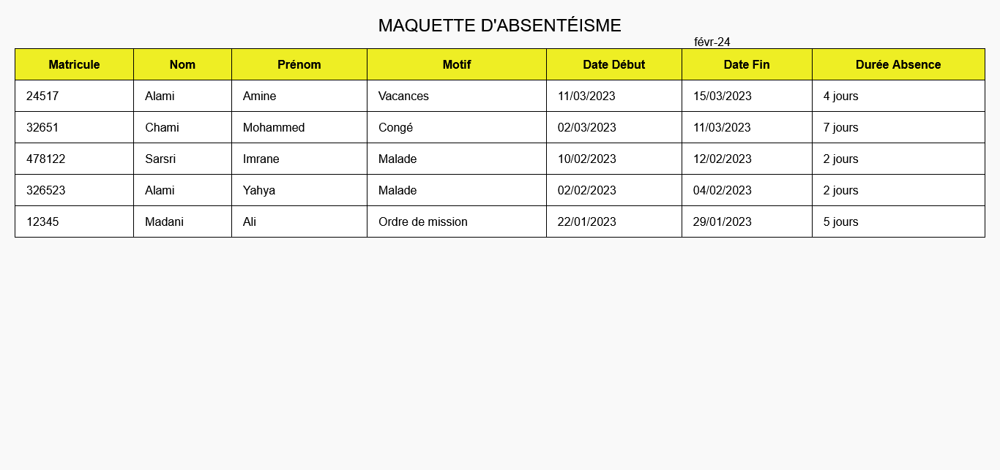

## Maquette package Absences
{:class="sectionHeader"}

<!-- new slide -->

### List des absences
{:width="1000px"}*figure: maquette list des absences*

<!-- new slide -->

### Ajouter absence
{:width="1000px"}*figure: maquette ajouter absence*

<!-- new slide -->
### Historique des absences
{:width="1000px"}*figure: Historique des absences*

<!-- new slide -->

### Document d'absentéisme

{:width="1000px"}*figure: maquette détails des absences*

<!-- new slide -->

### Print document d'absentéisme
{:width="1000px"}*figure: Print document d'absentéisme*

<!-- new slide -->
