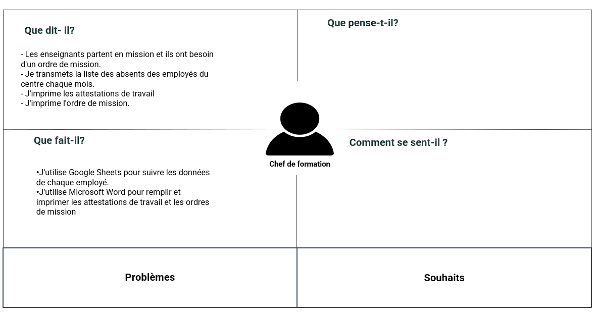

## Empathie de chef de formation

{:width="700"}

<!-- note -->

### Persona

Abdelmonaim HAMOUDA

### Date :

Le 05/03/2024

### Ce qu'il dit : 

- Les enseignants partent en mission et ils ont besoin d'un ordre de mission.
- Je transmets la liste des absents des employés du centre chaque mois.
- J'imprime les attestations de travail
- J'imprime l'ordre de mission.

### Ce qu’il fait :

- J'utilise Google Sheets pour suivre les données de chaque employé.
- J'utilise Microsoft Word pour remplir et imprimer les attestations de travail et les ordres de mission

<!-- new slide -->