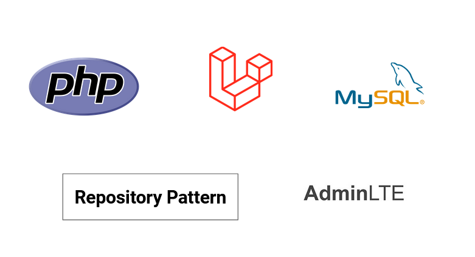

## Analyse technique

{:width="80%"}*figure: Analyse technique*

<!-- note -->

Pour le développement de le prototype, ont va utiliser de différentes technologies, notamment : 

- PHP: est un langage de script côté serveur.
    - Rôle : Gérer la logique métier de l'application, traiter les requêtes et générer des pages dynamiques.

- MySQL :  est une base de données relationnelle.
   - Rôle : Stocker et gérer les données de l'application.

- Laravel:  est un framework PHP.
   - Rôle : Faciliter le développement en fournissant une structure MVC, des outils de migration de base de données, etc.

- AdminLTE: est un thème d'administration basé sur Bootstrap.
    - Rôle: Offrir une interface utilisateur moderne et réactive pour la gestion de l'application.

Pour la mise en place des tests unitaires, on va séparer les tâches entre le frontend et le backend :

- Test unitaire : Séparation des tâches en frontend et backend pour l'ajout de tests unitaires.

- Interfaces : Les développeurs ne respectent pas les méthodes.

<!-- new slide -->
