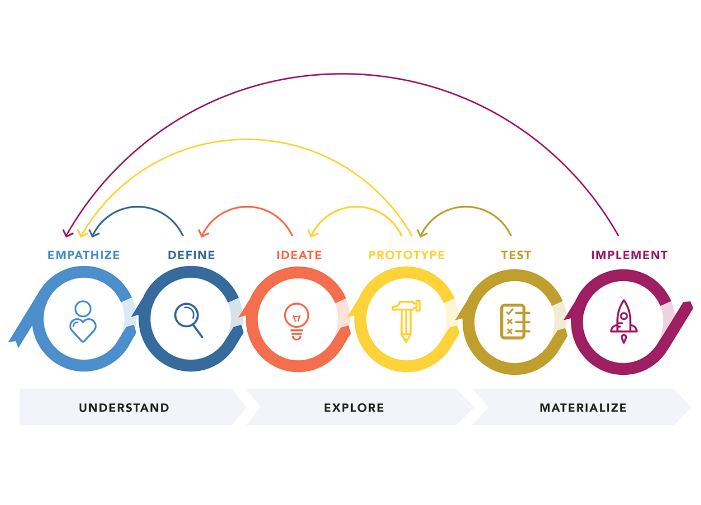

## Design thinking

{:width="900px"}*figure: Les étapes du Design Thinking*

<!-- note -->

- Le design thinking est une approche centrée sur l'humain pour résoudre des problèmes complexes et développer des solutions innovantes. Il met l'accent sur l'empathie, la collaboration multidisciplinaire, l'expérimentation et l'itération rapide.
Les étapes de design thinking : 

### Empathie

- Comprendre les besoins et les perspectives des utilisateurs concernés par le problème à résoudre. Cela implique d'observer, d'écouter et d'interagir avec les utilisateurs pour acquérir une compréhension approfondie de leurs besoins, motivations et défis.

### Définir le problème

- Définir clairement le problème à résoudre en se basant sur les informations recueillies lors de la phase d'empathie. Il s'agit de formuler une question ou un défi spécifique qui orientera le processus de conception.

### Idéation

- Générer un grand nombre d'idées créatives pour aborder le problème identifié. Encourager la pensée divergente, où toutes les idées sont les bienvenues, sans jugement, afin de favoriser l'exploration de différentes solutions possibles.

### Prototype 

- Créer des prototypes tangibles ou des représentations visuelles des solutions potentielles. Les prototypes peuvent être simples et rapides à réaliser, mais doivent être suffisamment concrets pour recueillir des retours et les itérer.

### Test

- Tester les prototypes auprès d’utilisateurs réels. Les premières maquettes comportent nécessairement des erreurs, qu’il faut identifier au plus vite et dont il faut ensuite tirer des enseignements.

<!-- new slide -->
