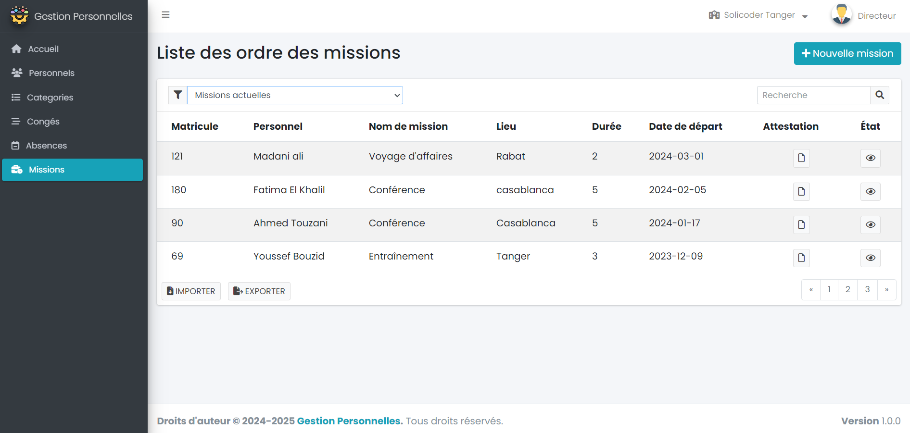
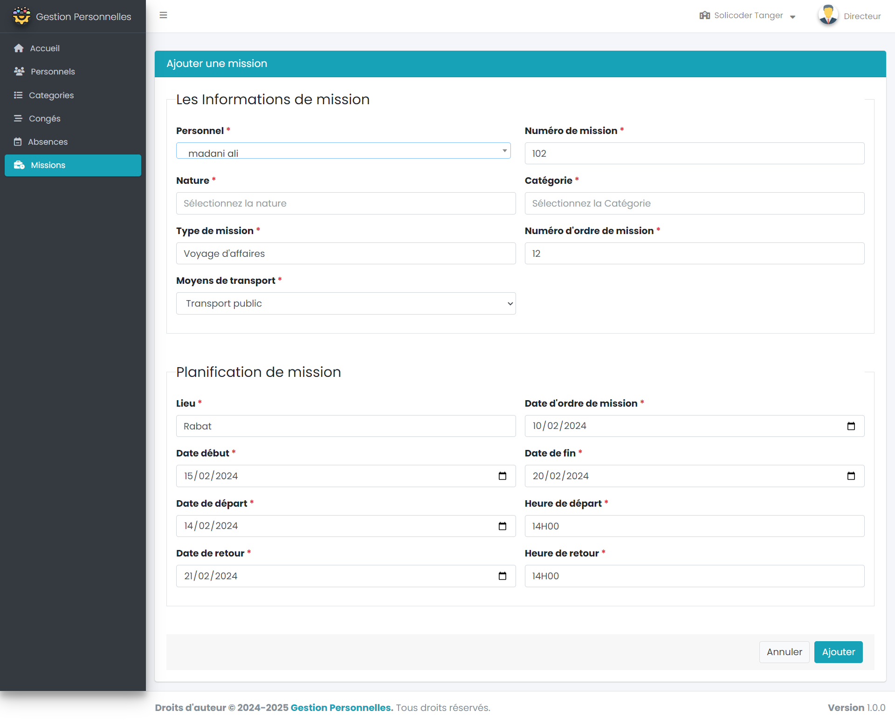
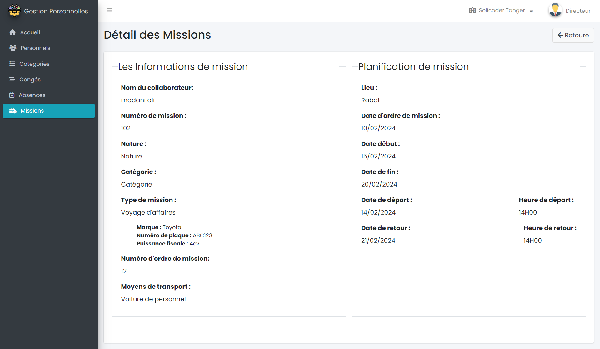
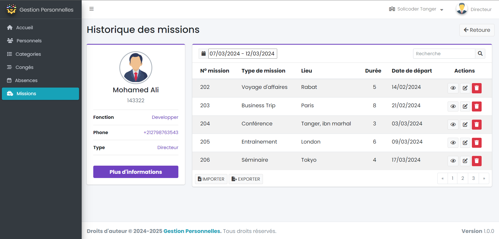

## Maquette package ordre des missions

<!-- new slide -->

**Liste d'ordre des missions**
{:width="700px"}*figure: maquette Liste d'ordre des missions*

<!-- new slide -->

**Form d'ordre des missions**
{:width="700px"}*figure: maquette Form des missions*

<!-- new slide -->

**Détails d'ordre des missions**
{:width="700px"}*figure: maquette Détails des missions*

<!-- new slide -->

**Attestation d'ordre des missions**
{:width="700px"}*figure: maquette Attestation d'ordre des missions*

<!-- new slide -->

**Historique d'ordre des missions**
{:width="700px"}*figure: maquette Historique d'ordre des missions*

<!-- new slide -->